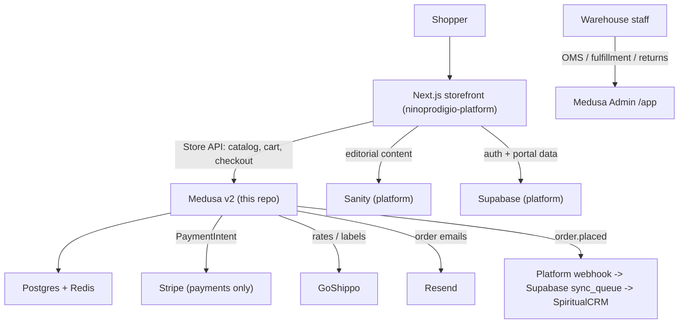

# Architecture

This document describes what the Medusa backend owns, where its boundaries are,
and how the post-purchase pipeline works. The canonical decision record is
**ADR-024** in the platform repo (`ninoprodigio-platform/docs/adr/`); this is the
Medusa-side summary.

## System context



## Ownership boundaries

| Concern | Owner | Notes |
|--------|-------|-------|
| Product catalog, variants, options, inventory | **Medusa** | Source of truth for the store |
| Pricing (store) | **Medusa** | Per-region/currency (USD) |
| Cart, taxes, promotions, totals | **Medusa** | Server-side cart with an ID |
| Orders, fulfillment, shipments, returns/exchanges/claims | **Medusa** | Operated from Medusa Admin |
| Payment processing | **Stripe** (via Medusa providers) | TWO accounts: Mundo Espiritual (products) + Gedelimbo (minutes). See integration-contract |
| Shipping rates + labels | **GoShippo** (via Medusa fulfillment provider) | |
| Order emails | **Resend** (via Medusa notification provider) | |
| Base / thumbnail product image | **Medusa** (File Module -> S3 on Cloud) | Admin, cart, emails, storefront fallback; populated by Shopify import |
| Editorial content + curated gallery + SEO | **Sanity** (platform) | Stub auto-created by this repo's `product.*` subscriber, keyed by `handle` |
| Auth / identity | **Supabase** (platform) | Medusa customer mapped by email |
| Membership / subscriptions | **Platform** (direct Stripe) | NOT in Medusa |
| CRM (client history, minutes balance) | **SpiritualCRM** (platform syncs) | Fed by `order.placed` notification |

## Product model

- Physical and digital products; ~250 products with variants.
- **Digital products have no shipping profile** -> checkout skips the shipping
  step automatically. Digital fulfillment is handled by a fulfillment
  provider/workflow that exposes a download artifact.
- The product **`handle`** is the storefront URL slug (`/shop/<handle>`) and the
  single durable cross-system key. Sanity `productDescription` docs link to the
  product by `handle` (`medusaHandle` field); never change handles after launch.

### Product content sync (two-tier)

Support/sales create products in Medusa; marketing enriches them in Sanity. This
backend owns a **`product.*` subscriber** that auto-creates/archives a Sanity
`productDescription` **stub** (keyed by `handle`) on `product.created` /
`product.updated` / `product.deleted`, so a product is sellable immediately and
the storefront falls back to Medusa's own fields until marketing fills the stub.
Images are **two-tier**: base/thumbnail in Medusa (S3), curated gallery in Sanity.
Needs Sanity write creds in env; must be **idempotent** (upsert by handle) since
products arrive from several channels — a small Shopify import (~80, mostly
inactive), manual admin entry, and an Excel/CSV import. See
`docs/integration-contract.md` -> "Product content sync".

## Sales channels

Medusa is the commerce backend for **all** selling surfaces, not just the public
web store. A **sales channel** models a selling surface / API client — it is NOT
geography (that's a region) nor inventory (that's a stock location).

**Convention: one channel per surface, each with its own publishable API key.**

| Channel | Surface | Status |
|---|---|---|
| **Web — ninoprodigio.com** | Public storefront (Next.js) — the store **default** | Live (today seeded as `Default Sales Channel`; rename pending — see below) |
| Línea Psíquica | Phone/psychic-line ordering (e.g. minutes) | Create when the surface is real |
| Mobile app | Future React Native / PWA client | Create when the surface is real |
| (others) | Marketplaces, POS, etc. | As needed |

Why this matters (not cosmetic):

- **Publishable key per channel.** Each client (web, app, Línea Psíquica tool) uses
  its own key, scoped to its channel — independently revocable, with per-key
  analytics. This is the concrete enabler of the platform's API-first / future RN
  app goal.
- **Per-channel product availability.** A product sells only in channels it is
  **linked** to. Lets us expose e.g. minutes packages only in the Línea Psíquica /
  app channel, or keep some products web-only.
- **Order attribution.** Every order carries `sales_channel_id` → revenue/reporting
  per surface with no hacks.
- **Per-channel stock locations & promotions/price lists** are also possible (one
  warehouse today, but the model is ready for more).

**Orthogonality (do not conflate):** channel ≠ region (currency/geo) ≠ Stripe
account. The Stripe provider is selected **per cart** (see integration-contract
"Stripe accounts"); a channel may be a *signal* (a Línea Psíquica / app cart of
minutes → Gedelimbo) but never overrides the one-provider-per-cart rule.

**Naming / robustness.** Because the default reference (`default_sales_channel_id`),
the publishable-key link, and product↔channel links are all **by id**, renaming a
channel's label is safe and needs **no re-import**. The only things a rename breaks
are **name-based lookups**. Therefore: resolve the web channel by
**`store.default_sales_channel_id`** (or a `SALES_CHANNEL_ID` env), **not** by the
literal string `"Default Sales Channel"`.

> **Current state / follow-up.** The seed currently creates `Default Sales Channel`
> and the Shopify import resolves it by that name. Planned follow-up (after the
> Shopify Cloud import, to keep that one-shot identical to the validated local run):
> rename the default to **"Web — ninoprodigio.com"** and switch the seed + import to
> resolve the channel by `default_sales_channel_id`. New surfaces (Línea Psíquica,
> mobile app) get their own named channel + publishable key when they go live, and
> products are bulk-linked to them then. Don't pre-create empty channels (YAGNI).

## Checkout

The storefront drives a Medusa cart and pays with the **Stripe Payment Element**:

1. Storefront ensures a Medusa cart, sets email + shipping address.
2. Sets a shipping method (Medusa shipping option backed by Shippo).
3. Initializes a payment session (Stripe provider) -> Medusa creates a Stripe
   PaymentIntent and returns the `client_secret`.
4. Storefront mounts `<PaymentElement>` and confirms payment.
5. Storefront completes the cart (`POST /store/carts/{id}/complete`) -> Medusa
   creates the Order.

The buyer never leaves the site (preserves the platform's on-site UX goal).

## Post-purchase fulfillment pipeline

A custom Medusa **workflow** models the operational flow, including a step that
pauses for the customer personalization follow-up before shipping:

```
order.placed
  -> warehouse prep
  -> personalization follow-up   (workflow pauses; resumes on confirmation)
  -> create shipment + GoShippo label
  -> mark shipped (tracking emailed via Resend)
  -> delivered
```

Returns/exchanges use Medusa core workflows (`beginExchangeOrderWorkflow`,
`confirmExchangeRequestWorkflow`, returns/claims) and are operated from the
admin.

## Customer identity

Supabase remains the identity provider. The platform maps each Supabase user to
a Medusa customer **by email** and stores the mapping in its `user_external_ids`
table (provider `medusa`, per ADR-022). On a user's first shop action the
platform does a find-or-create against Medusa's customer API. Guests check out
without a customer and are reconciled if they later register with the same email.

> This backend should treat **email** as the join key with the platform. Do not
> assume Medusa is the identity master.

## Minutes packages (later phase)

Pre-paid consultation minutes will be sold as **Medusa products** plus a custom
**module + `order.placed` subscriber** that credits a minutes balance. This is a
later phase; design the catalog so a `minutes` product type/metadata is feasible.

## Deferred (not in scope yet)

These are explicitly deferred (each needs its own planning + low-traffic
cutover); do not implement them preemptively:

- Making Supabase the authoritative customer **master** / flipping CRM sync
  direction.
- Migrating membership/subscriptions into Medusa.
- Retiring the legacy CRM e-commerce module.

## Deployment

**Medusa Cloud** (managed PaaS by the Medusa team):

- **Develop tier (~$29/mo)** for the build phase — connect the GitHub repo for
  push-to-deploy, preview environments, managed Postgres + Redis + workers, and
  the Cloud-gated Docs MCP + Cloud CLI.
- **Launch tier (~$99/mo)** for production — autoscaling, custom domains,
  zero-downtime deploys.

Cloud manages worker/server split; `MEDUSA_WORKER_MODE` still applies for local
and any self-hosted runs. Admin is served at `/app` (custom domain on Launch).

**Local development** runs Postgres + Redis via Docker Compose. **No lock-in:**
Medusa is MIT-licensed and data is exportable, so self-hosting on Railway
(one-click template) or Coolify (Docker Compose) remains a documented fallback.
