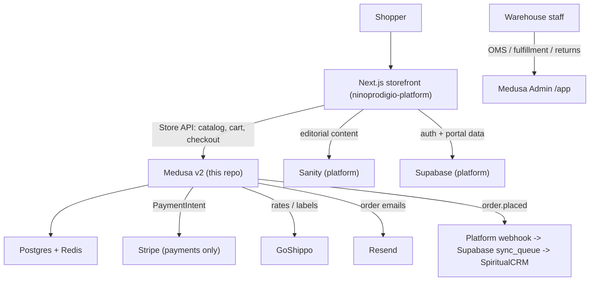

# Architecture

This document describes what the Medusa backend owns, where its boundaries are,
and how the post-purchase pipeline works. The canonical decision record is
**ADR-024** in the platform repo (`ninoprodigio-platform/docs/adr/`); this is the
Medusa-side summary.

## System context



## Ownership boundaries

| Concern | Owner | Notes |
|--------|-------|-------|
| Product catalog, variants, options, inventory | **Medusa** | Source of truth for the store |
| Pricing (store) | **Medusa** | Per-region/currency (USD) |
| Cart, taxes, promotions, totals | **Medusa** | Server-side cart with an ID |
| Orders, fulfillment, shipments, returns/exchanges/claims | **Medusa** | Operated from Medusa Admin |
| Payment processing | **Stripe** (via Medusa providers) | TWO accounts: Mundo Espiritual (products) + Gedelimbo (minutes). See integration-contract |
| Shipping rates + labels | **GoShippo** (via Medusa fulfillment provider) | |
| Order emails | **Resend** (via Medusa notification provider) | |
| Editorial content (descriptions, galleries, SEO) | **Sanity** (platform) | Linked by product `handle` |
| Auth / identity | **Supabase** (platform) | Medusa customer mapped by email |
| Membership / subscriptions | **Platform** (direct Stripe) | NOT in Medusa |
| CRM (client history, minutes balance) | **SpiritualCRM** (platform syncs) | Fed by `order.placed` notification |

## Product model

- Physical and digital products; ~250 products with variants.
- **Digital products have no shipping profile** -> checkout skips the shipping
  step automatically. Digital fulfillment is handled by a fulfillment
  provider/workflow that exposes a download artifact.
- The product **`handle`** is the storefront URL slug (`/shop/<handle>`). Sanity
  `productDescription` docs link to the product by `handle` (or a `sanity_id`
  stored in Medusa product metadata).

## Checkout

The storefront drives a Medusa cart and pays with the **Stripe Payment Element**:

1. Storefront ensures a Medusa cart, sets email + shipping address.
2. Sets a shipping method (Medusa shipping option backed by Shippo).
3. Initializes a payment session (Stripe provider) -> Medusa creates a Stripe
   PaymentIntent and returns the `client_secret`.
4. Storefront mounts `<PaymentElement>` and confirms payment.
5. Storefront completes the cart (`POST /store/carts/{id}/complete`) -> Medusa
   creates the Order.

The buyer never leaves the site (preserves the platform's on-site UX goal).

## Post-purchase fulfillment pipeline

A custom Medusa **workflow** models the operational flow, including a step that
pauses for the customer personalization follow-up before shipping:

```
order.placed
  -> warehouse prep
  -> personalization follow-up   (workflow pauses; resumes on confirmation)
  -> create shipment + GoShippo label
  -> mark shipped (tracking emailed via Resend)
  -> delivered
```

Returns/exchanges use Medusa core workflows (`beginExchangeOrderWorkflow`,
`confirmExchangeRequestWorkflow`, returns/claims) and are operated from the
admin.

## Customer identity

Supabase remains the identity provider. The platform maps each Supabase user to
a Medusa customer **by email** and stores the mapping in its `user_external_ids`
table (provider `medusa`, per ADR-022). On a user's first shop action the
platform does a find-or-create against Medusa's customer API. Guests check out
without a customer and are reconciled if they later register with the same email.

> This backend should treat **email** as the join key with the platform. Do not
> assume Medusa is the identity master.

## Minutes packages (later phase)

Pre-paid consultation minutes will be sold as **Medusa products** plus a custom
**module + `order.placed` subscriber** that credits a minutes balance. This is a
later phase; design the catalog so a `minutes` product type/metadata is feasible.

## Deferred (not in scope yet)

These are explicitly deferred (each needs its own planning + low-traffic
cutover); do not implement them preemptively:

- Making Supabase the authoritative customer **master** / flipping CRM sync
  direction.
- Migrating membership/subscriptions into Medusa.
- Retiring the legacy CRM e-commerce module.

## Deployment

- **Railway**: one-click Medusa template (managed Postgres + Redis, auto
  migrations on deploy, CORS pre-wired), or
- **Coolify**: Docker Compose (Medusa + Postgres + Redis) on the existing server.

Run with `MEDUSA_WORKER_MODE` set appropriately (shared for a single instance;
split server/worker when scaling). Admin is served at `/app`.
